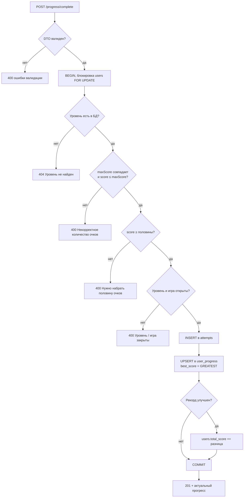

# REST API

Описание HTTP API сервера «Алгоритмики» (NestJS). Все эндпоинты доступны с префиксом `/api`.

| Окружение | Базовый URL |
|---|---|
| Docker Compose | `http://localhost:8080/api` |
| Разработка (напрямую в NestJS) | `http://localhost:3000/api` |
| Разработка (через dev-прокси Vite) | `http://localhost:5173/api` |

## Содержание

- [Общие правила](#общие-правила)
  - [Формат данных](#формат-данных)
  - [Аутентификация](#аутентификация)
  - [Ошибки](#ошибки)
  - [Ограничения](#ограничения)
- [Сводка эндпоинтов](#сводка-эндпоинтов)
- [Health](#health)
- [Auth](#auth)
- [Games](#games)
- [Progress](#progress)
- [Правила прохождения](#правила-прохождения)

---

## Общие правила

### Формат данных

- Тело запроса и ответа передаётся в JSON, заголовок `Content-Type: application/json`.
- Максимальный размер тела запроса: **100 KB**.
- Идентификаторы пользователей (`id`) возвращаются **строкой**, потому что в БД это `BIGINT`.
- Даты возвращаются в формате ISO 8601 (`2026-09-30T14:20:00.000Z`).
- Все успешные `POST`-запросы возвращают статус **`201 Created`**, включая `/auth/login`: это поведение NestJS по умолчанию.

### Аутентификация

Защищённые эндпоинты требуют JWT в заголовке `Authorization`:

```http
Authorization: Bearer <token>
```

Токен выдаётся при регистрации и входе. Срок жизни задаётся переменной `JWT_EXPIRES_IN` (по умолчанию `7d`). В полезной нагрузке токена лежат два поля:

```ts
interface JwtPayload {
  sub: string;   // id пользователя
  email: string;
}
```

Фронтенд хранит токен в `localStorage` под ключом `algostart_token`.

### Ошибки

Ошибки возвращаются в стандартном формате NestJS:

```json
{
  "statusCode": 401,
  "message": "Неверный email или пароль",
  "error": "Unauthorized"
}
```

При ошибке валидации `message` содержит **массив** строк:

```json
{
  "statusCode": 400,
  "message": [
    "Имя должно содержать от 2 до 50 символов",
    "Введите корректный email"
  ],
  "error": "Bad Request"
}
```

Валидация строгая (`whitelist` + `forbidNonWhitelisted`): поле, которого нет в DTO, вызовет ошибку `400` с сообщением вида `property foo should not exist`.

| Код | Когда возникает |
|---|---|
| `400` | Не прошла валидация DTO или нарушено правило прохождения уровня |
| `401` | Нет токена, токен недействителен или истёк, неверный логин/пароль |
| `404` | Игра, уровень или пользователь не найдены |
| `409` | Email уже зарегистрирован |
| `429` | Превышен лимит запросов |
| `503` | Нет соединения с базой данных (только `/health`) |

### Ограничения

| Что | Лимит |
|---|---|
| Все запросы к `/api/*` | 500 запросов за 15 минут с одного IP |
| Запросы к `/api/auth/*` | 50 запросов за 15 минут с одного IP |
| CORS: методы | `GET`, `POST` |
| CORS: заголовки | `Content-Type`, `Authorization` |
| CORS: источники | значение `FRONTEND_URL` (можно несколько через запятую) |

При превышении лимита сервер отвечает `429` и возвращает стандартные заголовки `RateLimit-*`:

```json
{ "statusCode": 429, "message": "Слишком много попыток. Попробуйте позднее." }
```

---

## Сводка эндпоинтов

| Метод | Путь | Доступ | Назначение |
|---|---|---|---|
| `GET` | `/api/health` | открыт | Проверка работы API и БД |
| `POST` | `/api/auth/register` | открыт | Регистрация |
| `POST` | `/api/auth/login` | открыт | Вход |
| `GET` | `/api/auth/me` | JWT | Профиль текущего пользователя |
| `GET` | `/api/games` | открыт | Список игр |
| `GET` | `/api/games/:code` | открыт | Игра с уровнями |
| `GET` | `/api/progress` | JWT | Прогресс текущего пользователя |
| `POST` | `/api/progress/complete` | JWT | Сохранение результата уровня |

---

## Health

### `GET /api/health`

Проверяет, что сервер запущен и может выполнить `SELECT 1` в PostgreSQL. Используется healthcheck'ом Docker Compose.

**Ответ `200`**

```json
{ "status": "ok", "database": "connected" }
```

**Ответ `503`**

```json
{
  "statusCode": 503,
  "message": "Database is unavailable",
  "error": "Service Unavailable"
}
```

---

## Auth

### `POST /api/auth/register`

Создаёт пользователя и сразу возвращает токен, отдельный вход после регистрации не нужен.

**Тело запроса**

| Поле | Тип | Правила |
|---|---|---|
| `name` | string | 2–50 символов, пробелы по краям обрезаются |
| `email` | string | корректный email, до 254 символов; обрезается и приводится к нижнему регистру |
| `password` | string | 6–72 символа (72 байта — предел bcrypt) |

```json
{
  "name": "Маша",
  "email": "masha@example.com",
  "password": "secret123"
}
```

**Ответ `201`**

```json
{
  "token": "eyJhbGciOiJIUzI1NiIsInR5cCI6IkpXVCJ9...",
  "user": {
    "id": "1",
    "name": "Маша",
    "email": "masha@example.com",
    "totalScore": 0,
    "createdAt": "2026-09-30T14:20:00.000Z"
  }
}
```

**Ошибки**

| Код | Сообщение |
|---|---|
| `400` | Сообщения валидации (см. таблицу полей) |
| `409` | `Пользователь с таким email уже зарегистрирован` |

Пароль хешируется bcrypt (10 раундов). Хеш никогда не возвращается в ответе.

---

### `POST /api/auth/login`

**Тело запроса**

| Поле | Тип | Правила |
|---|---|---|
| `email` | string | корректный email; регистр не важен |
| `password` | string | 1–72 символа |

```json
{ "email": "Masha@Example.com", "password": "secret123" }
```

**Ответ `201`**: такой же, как у `/register`.

**Ошибки**

| Код | Сообщение |
|---|---|
| `400` | `Введите корректный email` / `Введите пароль` |
| `401` | `Неверный email или пароль` |

Сервер намеренно не сообщает, что именно неверно (email или пароль), чтобы по ответу нельзя было проверить, зарегистрирован ли адрес.

---

### `GET /api/auth/me`

Возвращает профиль по токену. Фронтенд вызывает его при загрузке страницы, чтобы проверить сохранённую сессию.

**Ответ `200`**

```json
{
  "user": {
    "id": "1",
    "name": "Маша",
    "email": "masha@example.com",
    "totalScore": 250,
    "createdAt": "2026-09-30T14:20:00.000Z"
  }
}
```

**Ошибки**

| Код | Сообщение |
|---|---|
| `401` | `Необходимо войти в аккаунт` (нет заголовка или он не `Bearer ...`) |
| `401` | `Сессия недействительна или завершена` (подпись неверна или токен истёк) |
| `401` | `Пользователь не найден` (токен валиден, но пользователь удалён) |

---

## Games

Справочник игр и уровней. Данные попадают в БД из `backend/src/games/game-seeds.ts` при каждом старте сервера (см. [database.md](./database.md#начальные-данные-сидинг)).

> [!NOTE]
> Сейчас фронтенд эти эндпоинты не вызывает: список игр и содержимое уровней заданы в самом клиенте (`frontend/src/data/games.ts` и `frontend/src/games/*.tsx`). Сервер использует таблицы `games` и `levels` для проверки результатов в `/progress/complete`.

### `GET /api/games`

Список игр в порядке прохождения.

**Ответ `200`**

```json
{
  "games": [
    {
      "code": "sequence",
      "title": "Шаг за шагом",
      "shortTitle": "Последовательности",
      "description": "Расставляй действия в правильном порядке.",
      "icon": "🧩",
      "color": "purple",
      "order": 1,
      "path": "/games/sequence/1"
    }
  ]
}
```

`path` — маршрут первого уровня на фронтенде.

---

### `GET /api/games/:code`

Игра вместе со всеми уровнями.

**Параметры пути**

| Параметр | Значения |
|---|---|
| `code` | `sequence`, `robot`, `debugger`, `conditions` |

**Ответ `200`**

```json
{
  "code": "conditions",
  "title": "Если — то",
  "shortTitle": "Условия",
  "description": "Выбирай действие, которое подходит к условию.",
  "icon": "🌦️",
  "color": "green",
  "order": 4,
  "levels": [
    {
      "level": 1,
      "title": "Погода",
      "description": "Что взять, если на улице дождь?",
      "maxScore": 100,
      "content": {
        "condition": "Идёт дождь",
        "options": ["Зонт", "Мяч", "Санки"],
        "answer": 0
      }
    }
  ]
}
```

Структура `content` своя у каждой игры (см. [database.md](./database.md#структура-levelscontent)).

**Ошибки**

| Код | Сообщение |
|---|---|
| `404` | `Игра не найдена` |

---

## Progress

Все эндпоинты раздела требуют JWT.

### `GET /api/progress`

Прогресс текущего пользователя.

**Ответ `200`**

```jsonc
{
  "totalScore": 190,
  "completedCount": 2,
  "unlockedGames": ["sequence"],
  "completedLevels": [
    {
      "gameCode": "sequence",
      "level": 1,
      "score": 100,
      "maxScore": 100,
      "completedAt": "2026-09-30T14:25:00.000Z"
    },
    {
      "gameCode": "sequence",
      "level": 2,
      "score": 90,
      "maxScore": 100,
      "completedAt": "2026-09-30T14:31:00.000Z"
    }
  ],
  "progress": [/* те же записи, что в completedLevels */]
}
```

| Поле | Описание |
|---|---|
| `totalScore` | Сумма лучших результатов по всем уровням |
| `completedCount` | Количество пройденных уровней |
| `unlockedGames` | Коды открытых игр, в порядке прохождения |
| `completedLevels` | Лучший результат по каждому пройденному уровню, отсортирован по игре и номеру уровня |
| `progress` | Дубликат `completedLevels`, оставлен для совместимости |

Для каждого уровня хранится только лучший результат. Время `completedAt` обновляется, только когда рекорд улучшен.

---

### `POST /api/progress/complete`

Сохраняет результат прохождения уровня и возвращает обновлённый прогресс.

**Тело запроса**

| Поле | Тип | Правила |
|---|---|---|
| `gameCode` | string | один из кодов игр |
| `level` | integer | 1–20 |
| `score` | integer | 0–10 000 |
| `maxScore` | integer | 1–10 000, должен совпадать с `max_score` уровня в БД |

```json
{
  "gameCode": "sequence",
  "level": 3,
  "score": 80,
  "maxScore": 100
}
```

Пример вызова из клиента на TypeScript:

```ts
import { progressApi } from './api/client';

const summary = await progressApi.complete({
  gameCode: 'sequence',
  level: 3,
  score: 80,
  maxScore: 100,
});

console.log(summary.totalScore, summary.unlockedGames);
```

**Ответ `201`**: такой же объект, как у `GET /api/progress`.

**Ошибки**

| Код | Сообщение | Причина |
|---|---|---|
| `400` | сообщения валидации | неверный тип или диапазон полей |
| `400` | `Некорректное количество очков` | `maxScore` не совпадает с БД или `score > maxScore` |
| `400` | `Для прохождения нужно набрать хотя бы половину очков` | `score < ceil(maxScore / 2)` |
| `400` | `Сначала пройдите предыдущий уровень` | уровень ещё закрыт |
| `400` | `Эта игра пока закрыта` | не пройден 3-й уровень предыдущей игры |
| `404` | `Уровень не найден` | такого уровня нет в таблице `levels` |
| `404` | `Пользователь не найден` | пользователь из токена удалён |

---

## Правила прохождения

Сервер проверяет правила при каждом `POST /progress/complete`, не полагаясь на проверки клиента.

1. **Проходной балл**: не меньше половины максимума, `score >= ceil(maxScore / 2)`. При `maxScore = 100` это 50 очков.
2. **Уровни открываются по порядку**: уровень `N` можно сдать, только если пройден уровень `N − 1` той же игры.
3. **Игры открываются по порядку**: игра с `order_no = K` открывается после прохождения **3-го уровня** игры с `order_no = K − 1`. Первая игра открыта всегда.
4. **Очки начисляются только за улучшение рекорда**. Если прежний лучший результат был 70, а новый 90, к `totalScore` прибавится 20. Результат хуже рекорда очков не добавит, но попытка всё равно запишется в `attempts`.
5. **Каждая засчитанная попытка сохраняется** в таблицу `attempts`, даже если рекорд не улучшен. Запросы, отклонённые с ошибкой (балл ниже проходного, закрытый уровень), в `attempts` не попадают.

Всё сохранение выполняется в одной транзакции. Строка пользователя блокируется (`SELECT ... FOR UPDATE`), поэтому два одновременных запроса не начислят очки дважды.



---

См. также: [схема базы данных](./database.md) · [архитектура и деплой](./architecture.md) · [как добавить игру](./adding-a-game.md)
