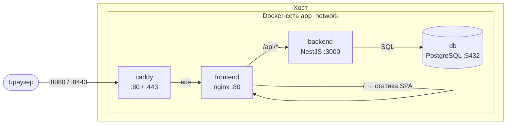
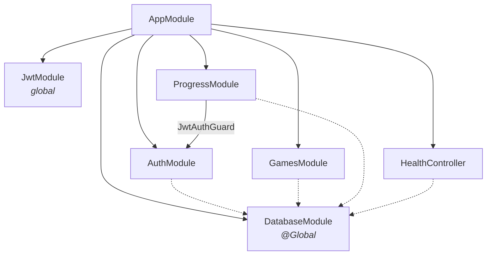
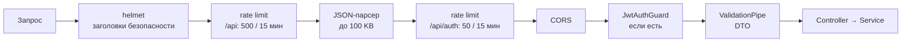
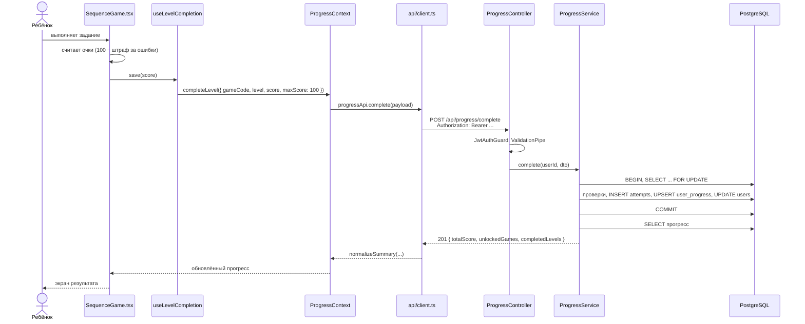
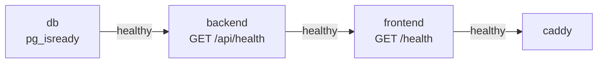
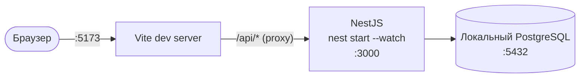

# Архитектура и деплой

Как устроено приложение «Алгоритмика», как проходит запрос, как оно разворачивается и какие у него настройки.

## Содержание

- [Стек](#стек)
- [Общая схема](#общая-схема)
- [Backend](#backend)
- [Frontend](#frontend)
- [Путь запроса: прохождение уровня](#путь-запроса-прохождение-уровня)
- [Развёртывание в Docker](#развёртывание-в-docker)
- [Режим разработки](#режим-разработки)
- [Переменные окружения](#переменные-окружения)
- [Безопасность](#безопасность)
- [Эксплуатация](#эксплуатация)
- [Известные ограничения](#известные-ограничения)

---

## Стек

| Слой | Технологии |
|---|---|
| Frontend | React 19, React Router 7, TypeScript 5.8, Vite 7 |
| Backend | NestJS 11 (Express), TypeScript, `pg`, `@nestjs/jwt`, `bcryptjs`, `class-validator` |
| Защита API | `helmet`, `express-rate-limit`, CORS |
| База данных | PostgreSQL 16 |
| Веб-серверы | Caddy 2 (входная точка), nginx 1.27 (статика и прокси к API) |
| Контейнеры | Docker Compose, образы на Node.js 22 (Alpine) |
| Тесты | Jest + ts-jest (backend) |

Для локальной разработки нужен Node.js **20+**.

---

## Общая схема



Наружу публикуются только порты **Caddy**. Frontend, backend и БД доступны только внутри Docker-сети (`expose`, а не `ports`), поэтому напрямую к PostgreSQL или NestJS снаружи не подключиться.

Роли контейнеров:

| Сервис | Образ | Роль |
|---|---|---|
| `caddy` | `caddy:2-alpine` | Входная точка: gzip-сжатие, опционально HTTPS, проксирование в `frontend` |
| `frontend` | собирается из `frontend/Dockerfile` | nginx отдаёт собранный Vite-бандл и проксирует `/api/*` в `backend` |
| `backend` | собирается из `backend/Dockerfile` | REST API на NestJS |
| `db` | `postgres:16-alpine` | Хранилище, данные в томе `postgres_data` |

---

## Backend

### Модули



| Модуль | Файлы | Ответственность |
|---|---|---|
| `DatabaseModule` | `database/` | Пул соединений `pg`, транзакции, создание схемы и сидинг при старте. Глобальный: `DatabaseService` доступен везде без импорта |
| `AuthModule` | `auth/` | Регистрация, вход, профиль. Экспортирует `JwtAuthGuard` для других модулей |
| `GamesModule` | `games/` | Справочник игр и уровней. `game-seeds.ts` — источник данных для БД |
| `ProgressModule` | `progress/` | Сохранение результатов, проверка правил прохождения, подсчёт очков |
| `HealthController` | `health.controller.ts` | Проверка доступности API и БД |

Слои внутри модуля стандартные для NestJS:

- **Controller** принимает HTTP-запрос и отдаёт ответ, бизнес-логики не содержит.
- **DTO** (`dto/*.dto.ts`) описывает и валидирует тело запроса через декораторы `class-validator`.
- **Service** содержит бизнес-логику и SQL-запросы.
- **Guard** (`JwtAuthGuard`) проверяет токен и кладёт `{ id, email }` в `request.user`. Декоратор `@CurrentUser()` достаёт его в контроллере.

### Конвейер обработки запроса

Порядок задан в `backend/src/main.ts`:



Кроме того, в `main.ts` включены:

- глобальный префикс `/api`;
- `trust proxy`, чтобы rate limit считал запросы по реальному IP клиента, а не по IP прокси (см. `TRUST_PROXY_HOPS`);
- `enableShutdownHooks()`: при остановке контейнера пул соединений с БД закрывается корректно.

### Загрузка конфигурации

`backend/src/config/load-env.ts` импортируется первой строкой `app.module.ts` и читает `.env` независимо от текущей директории. Приоритет (от высшего к низшему):

1. переменные окружения процесса;
2. `backend/.env`;
3. корневой `.env`.

---

## Frontend

### Структура

```text
frontend/src/
├── main.tsx              точка входа, провайдеры
├── app/App.tsx           маршруты
├── api/client.ts         HTTP-клиент, хранение токена, нормализация ответов
├── context/
│   ├── AuthContext.tsx     текущий пользователь, вход/выход
│   └── ProgressContext.tsx прогресс, открытые игры и уровни
├── hooks/
│   └── useLevelCompletion.ts  сохранение результата уровня
├── data/games.ts         список игр на клиенте
├── config/release.ts     этап демонстрации (releaseStage)
├── games/                компоненты мини-игр
├── components/           общие компоненты (карточки, каркас игры, выбор уровня...)
├── pages/                страницы
└── styles/               CSS
```

### Маршруты

| Путь | Страница | Доступ |
|---|---|---|
| `/` | `HomePage` | все |
| `/about` | `AboutPage` | все |
| `/login`, `/register` | `LoginPage`, `RegisterPage` | все |
| `/dashboard` | `DashboardPage` | авторизованные |
| `/games` | `GamesPage` | авторизованные, этап ≥ 2 |
| `/games/:gameCode/:level` | `GamePage` | авторизованные, этап ≥ 2, игра опубликована и уровень открыт |
| `/progress` | `ProgressPage` | авторизованные, этап ≥ 6 |
| `/profile` | `ProfilePage` | авторизованные, этап ≥ 6 |
| `*` | `NotFoundPage` | все |

Закрытые маршруты оборачивает `ProtectedRoute`: без токена он перенаправляет на вход.

### Состояние

- **`AuthContext`** хранит пользователя. Токен лежит в `localStorage` (`algostart_token`), при загрузке приложения проверяется запросом `GET /api/auth/me`.
- **`ProgressContext`** загружает `GET /api/progress` и даёт компонентам функции `isGameUnlocked`, `isLevelUnlocked`, `bestFor`, `completeLevel`. При ответе `401` выполняет выход.
- **`api/client.ts`** нормализует ответы сервера (`normalizeUser`, `normalizeSummary`), поэтому клиент устойчив к небольшим изменениям формата: например, принимает и `token`, и `accessToken`.

Проверки открытости уровней на клиенте нужны только для интерфейса (скрыть или заблокировать кнопку). Решающая проверка выполняется на сервере.

### Этапы демонстрации (`releaseStage`)

`frontend/src/config/release.ts` задаёт, какая часть приложения видна пользователю. Это позволяет показывать проект поэтапно, не удаляя код:

| Этап | Что открыто |
|---|---|
| 1 | Регистрация, вход, личный кабинет |
| 2 | + игра «Шаг за шагом» |
| 3 | + «Робот-почтальон» |
| 4 | + «Ловец ошибок» |
| 5 | + «Если — то» |
| 6 | + страницы прогресса и профиля (полная версия) |

Опубликованные игры вычисляются как `games.slice(0, releaseStage - 1)`. Этап задаётся на этапе **сборки**: после изменения фронтенд нужно пересобрать.

---

## Путь запроса: прохождение уровня



Подробные правила проверки: [api.md → Правила прохождения](./api.md#правила-прохождения).

---

## Развёртывание в Docker

### Порядок запуска

Сервисы стартуют по цепочке healthcheck'ов, поэтому сайт не откроется, пока не готовы все зависимости:



| Сервис | Проверка | Интервал | Попыток |
|---|---|---|---|
| `db` | `pg_isready` | 5 с | 10 |
| `backend` | `fetch('http://127.0.0.1:3000/api/health')` | 10 с | 10 |
| `frontend` | `wget http://127.0.0.1/health` | 10 с | 10 |

Все сервисы запускаются с `restart: unless-stopped`.

### Сборка образов

Оба Dockerfile многоэтапные:

- **backend**: этап `build` собирает TypeScript (`nest build`), этап `production` ставит только production-зависимости (`npm ci --omit=dev`), копирует `dist/` и запускается от непривилегированного пользователя `node`.
- **frontend**: этап `build` выполняет `tsc -b && vite build`, итоговый образ — nginx со статикой из `dist/` и конфигом `nginx.conf`.

Теги образов: `algorithmika-backend:${RELEASE_ID}` и `algorithmika-frontend:${RELEASE_ID}` (по умолчанию `local`).

### Запуск

```bash
cp .env.example .env        # Windows PowerShell: Copy-Item .env.example .env
# отредактировать .env: POSTGRES_PASSWORD, DB_PASSWORD, JWT_SECRET
docker compose --env-file .env up -d --build
```

Проверка:

```bash
docker compose ps
curl http://localhost:8080/api/health
# {"status":"ok","database":"connected"}
```

Те же действия есть в виде npm-скриптов в корневом `package.json`:

| Скрипт | Команда |
|---|---|
| `npm run docker:config` | проверить `docker-compose.yml` и `.env` без запуска |
| `npm run docker:up` | собрать и запустить |
| `npm run docker:logs` | смотреть логи |
| `npm run docker:down` | остановить (данные сохраняются) |

### Тома

| Том | Содержимое |
|---|---|
| `postgres_data` | Данные PostgreSQL |
| `caddy_data` | Сертификаты Caddy |
| `caddy_config` | Конфигурация Caddy |

`docker compose down` оставляет тома. `docker compose down -v` удаляет их вместе со всеми данными.

### HTTPS и домен

Адрес сайта задаёт переменная `SITE_ADDRESS`, которую читает `Caddyfile`:

```caddy
{$SITE_ADDRESS::80} {
    encode gzip
    reverse_proxy frontend:80
}
```

Возможны две схемы:

1. **HTTPS на хостовом nginx** (её предполагают комментарии в `.env.example`). `SITE_ADDRESS=:80`, `APP_BIND_ADDRESS=127.0.0.1`, а nginx на сервере принимает HTTPS и проксирует на `127.0.0.1:8080`. Цепочка прокси: nginx хоста → Caddy → nginx frontend → backend.
2. **HTTPS на Caddy.** `SITE_ADDRESS=example.com` — Caddy сам получит сертификат Let's Encrypt. Для этого домен должен указывать на сервер, а порты 80 и 443 должны быть доступны снаружи (`APP_PORT=80`, `HTTPS_PORT=443`).

---

## Режим разработки



```bash
npm install
npm run install:all
npm run dev
```

`npm run dev` через `concurrently` запускает три процесса:

| Имя | Что делает |
|---|---|
| `backend` | `nest start --watch` на порту 3000 |
| `frontend` | Vite на порту 5173 |
| `site` | `scripts/show-dev-url.mjs`: ждёт, пока ответят и фронтенд, и `/api/health`, и печатает ссылку на сайт |

Vite проксирует `/api` на `VITE_DEV_API_TARGET` (по умолчанию `http://localhost:3000`), поэтому фронтенд обращается к API по относительному пути и CORS в разработке не мешает.

Тесты backend:

```bash
npm test        # из корня; то же, что npm test --prefix backend
```

Покрыты `AuthService` (регистрация, повторный email, вход, одинаковая ошибка при неверном логине/пароле) и `ProgressService` (сбор прогресса, начисление разницы рекордов, проходной балл, блокировка следующей игры).

---

## Переменные окружения

Используются три файла, у каждого есть `.env.example`:

| Файл | Кто читает | Когда |
|---|---|---|
| `.env` (корень) | Docker Compose, а также backend как запасной вариант | всегда |
| `backend/.env` | backend (приоритетнее корневого) | разработка |
| `frontend/.env` | Vite | разработка и сборка |

### Docker Compose (корневой `.env`)

| Переменная | По умолчанию | Описание |
|---|---|---|
| `COMPOSE_PROJECT_NAME` | `algorithmika` | Префикс имён контейнеров и томов |
| `APP_BIND_ADDRESS` | `0.0.0.0` | На каком интерфейсе слушает Caddy. На сервере за nginx лучше `127.0.0.1` |
| `APP_PORT` | `8080` | Внешний HTTP-порт |
| `HTTPS_PORT` | `8443` | Внешний HTTPS-порт |
| `SITE_ADDRESS` | `:80` | Адрес сайта для Caddy (`:80` или домен) |
| `RELEASE_ID` | `local` | Тег Docker-образов |
| `POSTGRES_DB` | `algorithmika` | Имя БД. Передаётся и в `db`, и в `backend` как `DB_NAME` |
| `POSTGRES_USER` | `postgres` | Пользователь, **которого создаёт** контейнер `db` |
| `POSTGRES_PASSWORD` | `root` | Пароль, **который задаёт** контейнер `db` |

> [!IMPORTANT]
> Backend подключается к БД с `DB_USER` / `DB_PASSWORD`, а контейнер `db` создаёт пользователя из `POSTGRES_USER` / `POSTGRES_PASSWORD`. Это **разные переменные**, и их значения должны совпадать. Если поменять только `POSTGRES_PASSWORD`, backend не сможет подключиться.
>
> Кроме того, `POSTGRES_*` применяются только при **первой** инициализации тома. Если том `postgres_data` уже существует, смена пароля в `.env` ничего не изменит в БД.

### Backend

| Переменная | По умолчанию | Описание |
|---|---|---|
| `NODE_ENV` | — | `production` в Docker. В production обязателен `JWT_SECRET` |
| `PORT` | `3000` | Порт NestJS |
| `DATABASE_URL` | — | Строка подключения. Если задана, `DB_*` игнорируются |
| `DB_HOST` | `localhost` | Хост БД. В Docker принудительно `db` |
| `DB_PORT` | `5432` | Порт БД. В Docker принудительно `5432` |
| `DB_NAME` | `algorithmika` | Имя БД |
| `DB_USER` | `postgres` | Пользователь БД |
| `DB_PASSWORD` | `root` | Пароль БД |
| `DB_SSL` | `false` | `true` включает SSL без проверки сертификата |
| `JWT_SECRET` | в dev: `local-development-secret-change-me` | Секрет подписи токенов. Docker Compose **не запустится** без него |
| `JWT_EXPIRES_IN` | `7d` | Срок жизни токена в формате [`ms`](https://github.com/vercel/ms): `1h`, `7d` |
| `FRONTEND_URL` | `http://localhost:5173` (в Docker `http://localhost:8080`) | Разрешённые CORS-источники через запятую |
| `TRUST_PROXY_HOPS` | `2` | Сколько прокси стоит перед NestJS. Поддерживаются только `1` и `2`: любое значение, кроме `1`, считается как `2` |

Как выбрать `TRUST_PROXY_HOPS`:

| Схема | Значение |
|---|---|
| Разработка: Vite proxy → NestJS | `1` |
| Docker: Caddy → nginx → NestJS | `2` |

### Frontend

| Переменная | По умолчанию | Описание |
|---|---|---|
| `VITE_API_URL` | `/api` | Базовый URL API. Встраивается в бандл при сборке |
| `VITE_DEV_API_TARGET` | `http://localhost:3000` | Куда Vite dev server проксирует `/api` |

---

## Безопасность

| Мера | Где |
|---|---|
| Пароли хешируются bcrypt (10 раундов), хеш не покидает сервер | `AuthService` |
| JWT с настраиваемым сроком жизни; без секрета production не стартует | `app.module.ts` |
| Одинаковая ошибка для неверного email и неверного пароля | `AuthService.login` |
| Ограничение частоты запросов, отдельно строже для `/auth` | `main.ts` |
| Заголовки безопасности (`helmet`) | `main.ts` |
| Строгая валидация входных данных, лишние поля запрещены | `ValidationPipe` |
| Лимит размера тела запроса 100 KB | `main.ts` |
| Параметризованные SQL-запросы | все сервисы |
| Правила прохождения и подсчёт очков проверяются на сервере в транзакции с блокировкой | `ProgressService` |
| Backend в контейнере работает не от root | `backend/Dockerfile` |
| Наружу открыт только Caddy, БД и API изолированы в Docker-сети | `docker-compose.yml` |

---

## Эксплуатация

Логи конкретного сервиса:

```bash
docker compose logs -f backend
```

Резервная копия БД и восстановление:

```bash
docker compose exec -T db pg_dump -U postgres algorithmika > backup.sql
docker compose exec -T db psql -U postgres -d algorithmika < backup.sql
```

Обновление после изменений в коде:

```bash
git pull
docker compose --env-file .env up -d --build
```

Схема БД и справочник игр обновятся автоматически при старте backend (см. [database.md](./database.md#создание-схемы)).

---

## Известные ограничения

- **Очки считает клиент.** Сервер проверяет диапазон, проходной балл и порядок прохождения, но само значение `score` присылает браузер. Отправив запрос вручную, можно получить максимум очков за открытый уровень.
- **Задания продублированы.** Содержимое уровней на фронтенде (`frontend/src/games/*.tsx`) и в сидах (`game-seeds.ts`) разное, `GET /api/games` клиентом не используется.
- **Три уровня в игре заданы в коде.** Число 3 встречается и на клиенте, и в `ProgressService` (следующая игра открывается после 3-го уровня предыдущей). Подробнее: [adding-a-game.md](./adding-a-game.md#ограничение-три-уровня).
- **Нет миграций.** Схема создаётся через `CREATE TABLE IF NOT EXISTS`, изменения существующих таблиц нужно применять вручную.
- **Токен в `localStorage`.** Доступен JavaScript-коду страницы, поэтому XSS-уязвимость позволила бы его украсть. Для учебного проекта это приемлемо; альтернатива — `httpOnly`-cookie.

---

См. также: [REST API](./api.md) · [схема базы данных](./database.md) · [как добавить игру](./adding-a-game.md)
