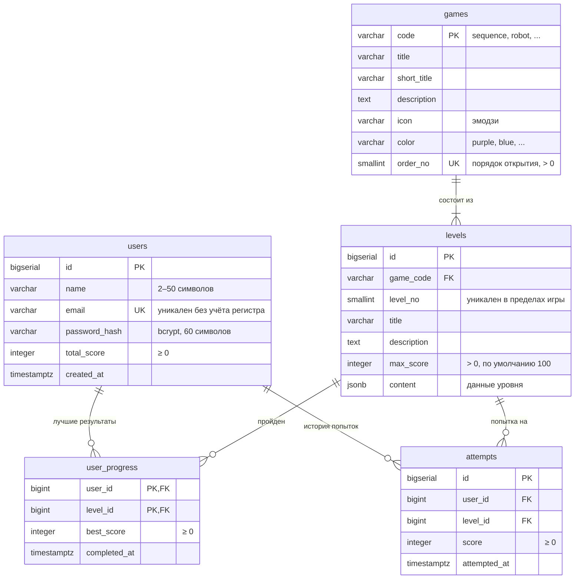

# Схема базы данных

«Алгоритмика» хранит данные в **PostgreSQL 16**. Сервер работает с БД напрямую через драйвер [`pg`](https://node-postgres.com/) без ORM: все запросы написаны на SQL в сервисах NestJS.

## Содержание

- [ER-диаграмма](#er-диаграмма)
- [Таблицы](#таблицы)
  - [users](#users)
  - [games](#games)
  - [levels](#levels)
  - [user_progress](#user_progress)
  - [attempts](#attempts)
- [Структура levels.content](#структура-levelscontent)
- [Создание схемы](#создание-схемы)
- [Начальные данные (сидинг)](#начальные-данные-сидинг)
- [Подключение](#подключение)
- [Полезные запросы](#полезные-запросы)

---

## ER-диаграмма



Схема делится на две части:

- **Справочник контента**: `games` и `levels`. Заполняется из кода при старте сервера, пользователи его не меняют.
- **Пользовательские данные**: `users`, `user_progress`, `attempts`.

`user_progress` хранит **текущее состояние** (один лучший результат на пару «пользователь — уровень»), а `attempts` хранит **историю** (все засчитанные попытки). `users.total_score` — денормализованная сумма `best_score`: её пересчитывают при каждом улучшении рекорда, чтобы не суммировать `user_progress` на каждый запрос.

---

## Таблицы

### `users`

Зарегистрированные пользователи.

| Колонка | Тип | Ограничения | Описание |
|---|---|---|---|
| `id` | `BIGSERIAL` | `PRIMARY KEY` | Идентификатор |
| `name` | `VARCHAR(50)` | `NOT NULL` | Отображаемое имя |
| `email` | `VARCHAR(254)` | `NOT NULL` | Email, хранится в нижнем регистре |
| `password_hash` | `VARCHAR(60)` | `NOT NULL` | Хеш bcrypt |
| `total_score` | `INTEGER` | `NOT NULL DEFAULT 0`, `CHECK (total_score >= 0)` | Сумма лучших результатов |
| `created_at` | `TIMESTAMPTZ` | `NOT NULL DEFAULT NOW()` | Дата регистрации |

**Индексы**

| Имя | Определение | Зачем |
|---|---|---|
| `users_email_lower_unique` | `UNIQUE (LOWER(email))` | `Masha@mail.ru` и `masha@mail.ru` считаются одним адресом |

Уникальность задана функциональным индексом, а не `UNIQUE` на колонке. Поэтому поиск при входе тоже идёт по `LOWER(email) = LOWER($1)`, чтобы индекс использовался. Нарушение уникальности (код ошибки PostgreSQL `23505`) сервер превращает в HTTP `409`.

`VARCHAR(60)` для хеша подобран под длину строки bcrypt, `VARCHAR(254)` для email — под максимальную длину адреса по RFC 5321.

---

### `games`

Мини-игры. Первичный ключ — текстовый код, а не число: код используется в URL (`/games/robot/1`), в API и в коде фронтенда.

| Колонка | Тип | Ограничения | Описание |
|---|---|---|---|
| `code` | `VARCHAR(32)` | `PRIMARY KEY` | Код игры: `sequence`, `robot`, `debugger`, `conditions` |
| `title` | `VARCHAR(100)` | `NOT NULL` | Название («Шаг за шагом») |
| `short_title` | `VARCHAR(100)` | `NOT NULL` | Тема («Последовательности») |
| `description` | `TEXT` | `NOT NULL` | Описание для карточки |
| `icon` | `VARCHAR(16)` | `NOT NULL` | Эмодзи-иконка |
| `color` | `VARCHAR(16)` | `NOT NULL` | Цветовая тема карточки |
| `order_no` | `SMALLINT` | `NOT NULL UNIQUE`, `CHECK (order_no > 0)` | Порядок открытия игр |

Текущее содержимое:

| `order_no` | `code` | `title` | Тема |
|---|---|---|---|
| 1 | `sequence` | Шаг за шагом | Последовательности |
| 2 | `robot` | Робот-почтальон | Команды роботу |
| 3 | `debugger` | Ловец ошибок | Исправление ошибок |
| 4 | `conditions` | Если — то | Условия |

---

### `levels`

Уровни игр.

| Колонка | Тип | Ограничения | Описание |
|---|---|---|---|
| `id` | `BIGSERIAL` | `PRIMARY KEY` | Идентификатор |
| `game_code` | `VARCHAR(32)` | `NOT NULL`, `REFERENCES games(code) ON DELETE CASCADE` | Игра |
| `level_no` | `SMALLINT` | `NOT NULL`, `CHECK (level_no > 0)` | Номер уровня в игре |
| `title` | `VARCHAR(100)` | `NOT NULL` | Название уровня |
| `description` | `TEXT` | `NOT NULL` | Задание |
| `max_score` | `INTEGER` | `NOT NULL DEFAULT 100`, `CHECK (max_score > 0)` | Максимум очков |
| `content` | `JSONB` | `NOT NULL DEFAULT '{}'` | Данные уровня (см. [ниже](#структура-levelscontent)) |

**Ограничения**

- `UNIQUE (game_code, level_no)`: в одной игре не может быть двух уровней с одним номером. Также служит целью для `ON CONFLICT` при сидинге.

Снаружи уровень адресуется парой `(game_code, level_no)`, а суррогатный `id` используется только во внешних ключах `user_progress` и `attempts`, чтобы они были компактнее.

---

### `user_progress`

Лучший результат пользователя на каждом пройденном уровне. Если записи нет, уровень не пройден.

| Колонка | Тип | Ограничения | Описание |
|---|---|---|---|
| `user_id` | `BIGINT` | `REFERENCES users(id) ON DELETE CASCADE` | Пользователь |
| `level_id` | `BIGINT` | `REFERENCES levels(id) ON DELETE CASCADE` | Уровень |
| `best_score` | `INTEGER` | `NOT NULL`, `CHECK (best_score >= 0)` | Лучший результат |
| `completed_at` | `TIMESTAMPTZ` | `NOT NULL DEFAULT NOW()` | Когда установлен рекорд |

**Первичный ключ**: составной `(user_id, level_id)`. Он гарантирует ровно одну запись на пару и позволяет делать атомарный `UPSERT`:

```sql
INSERT INTO user_progress (user_id, level_id, best_score, completed_at)
VALUES ($1, $2, $3, NOW())
ON CONFLICT (user_id, level_id) DO UPDATE SET
  best_score = GREATEST(user_progress.best_score, EXCLUDED.best_score),
  completed_at = CASE
    WHEN EXCLUDED.best_score > user_progress.best_score THEN NOW()
    ELSE user_progress.completed_at
  END;
```

---

### `attempts`

Журнал всех засчитанных попыток. Нужен для истории и статистики, на логику открытия уровней не влияет.

| Колонка | Тип | Ограничения | Описание |
|---|---|---|---|
| `id` | `BIGSERIAL` | `PRIMARY KEY` | Идентификатор |
| `user_id` | `BIGINT` | `NOT NULL`, `REFERENCES users(id) ON DELETE CASCADE` | Пользователь |
| `level_id` | `BIGINT` | `NOT NULL`, `REFERENCES levels(id) ON DELETE CASCADE` | Уровень |
| `score` | `INTEGER` | `NOT NULL`, `CHECK (score >= 0)` | Результат попытки |
| `attempted_at` | `TIMESTAMPTZ` | `NOT NULL DEFAULT NOW()` | Время попытки |

**Индексы**

| Имя | Определение | Зачем |
|---|---|---|
| `attempts_user_time_idx` | `(user_id, attempted_at DESC)` | Быстрая выборка последних попыток пользователя |

---

### Каскадное удаление

Все внешние ключи объявлены с `ON DELETE CASCADE`:

- удаление пользователя удаляет его прогресс и попытки;
- удаление игры удаляет её уровни, а вместе с ними прогресс и попытки по этим уровням.

---

## Структура `levels.content`

`content` хранится в `JSONB`, потому что у каждой игры свой формат задания. Отдельная таблица под каждый тип игры усложнила бы схему, а поля сверх общих (`title`, `description`, `max_score`) нужны только конкретной игре.

Форматы описаны в TypeScript-нотации:

```ts
// sequence — «Шаг за шагом»: действия в правильном порядке
interface SequenceContent {
  items: string[];
}

// robot — «Робот-почтальон»: клетчатое поле, координаты [x, y]
interface RobotContent {
  width: number;
  height: number;
  start: [number, number];
  target: [number, number];
  obstacles: [number, number][];
}

// debugger — «Ловец ошибок»: формат зависит от уровня
type DebuggerContent =
  | { steps: string[]; wrongStep: number }     // лишний шаг (индекс с 0)
  | { steps: string[]; missingStep: string }   // пропущенный шаг
  | { commands: string[]; wrongStep: number }; // неверная команда

// conditions — «Если — то»: условие и варианты действий
interface ConditionsContent {
  condition: string;
  options: string[];
  answer: number; // индекс правильного варианта
}
```

> [!NOTE]
> Сейчас фронтенд не читает `content` из API: задания каждой игры заданы в её компоненте (`frontend/src/games/*.tsx`) и отличаются от данных в БД. На сервере из таблицы `levels` реально используются наличие уровня и `max_score` при проверке результата.

---

## Создание схемы

Отдельных миграций нет. При старте сервер (`DatabaseService.onModuleInit`):

1. Пытается выполнить `SELECT 1`. Если БД ещё не готова, повторяет до **10 раз** с паузой **2 секунды**.
2. Выполняет `CREATE TABLE IF NOT EXISTS` / `CREATE INDEX IF NOT EXISTS` для всех таблиц.
3. Заполняет справочник игр и уровней.

Повторный запуск безопасен: существующие таблицы и данные не трогаются.

> [!WARNING]
> `CREATE TABLE IF NOT EXISTS` не изменяет **существующие** таблицы. Если добавить колонку в `createSchema()`, на уже созданной БД она не появится. Её нужно добавить вручную (`ALTER TABLE ...`) либо пересоздать том: `docker compose down -v` удалит **все** данные.

---

## Начальные данные (сидинг)

Игры и уровни описаны в `backend/src/games/game-seeds.ts` (массив `GAME_SEEDS`) и записываются в БД в одной транзакции при каждом старте:

```sql
INSERT INTO games (...) VALUES (...)
ON CONFLICT (code) DO UPDATE SET title = EXCLUDED.title, ...;

INSERT INTO levels (...) VALUES (...)
ON CONFLICT (game_code, level_no) DO UPDATE SET title = EXCLUDED.title, ...;
```

Благодаря `ON CONFLICT ... DO UPDATE`:

- новые игры и уровни добавляются;
- изменённые тексты, `max_score` и `content` обновляются;
- `levels.id` не меняется, поэтому прогресс пользователей сохраняется.

Удаление из `GAME_SEEDS` **не** удаляет запись из БД: её нужно удалить вручную.

Как добавить игру или уровень: [adding-a-game.md](./adding-a-game.md).

---

## Подключение

Пул соединений создаётся в `backend/src/database/database.service.ts`:

| Параметр | Значение |
|---|---|
| Максимум соединений | 10 |
| Закрытие простаивающего соединения | 30 секунд |
| Таймаут подключения | 5 секунд |

Если задан `DATABASE_URL`, используется он. Иначе строка подключения собирается из `DB_HOST`, `DB_PORT`, `DB_NAME`, `DB_USER`, `DB_PASSWORD`. При `DB_SSL=true` включается SSL без проверки сертификата (`rejectUnauthorized: false`), что подходит для облачных БД с самоподписанным сертификатом. Полный список переменных: [architecture.md](./architecture.md#переменные-окружения).

Транзакции выполняются через `DatabaseService.transaction()`:

```ts
await this.database.transaction(async (client) => {
  await client.query('SELECT 1 FROM users WHERE id = $1 FOR UPDATE', [userId]);
  // ... остальные запросы на том же client
});
// BEGIN / COMMIT / ROLLBACK и возврат соединения в пул выполняются автоматически
```

Все запросы параметризованы (`$1`, `$2`, ...), значения пользователя в SQL-строку не подставляются.

---

## Полезные запросы

Подключиться к БД в Docker:

```bash
docker compose exec db psql -U postgres -d algorithmika
```

Рейтинг пользователей:

```sql
SELECT name, total_score
FROM users
ORDER BY total_score DESC
LIMIT 10;
```

Прогресс пользователя по играм:

```sql
SELECT g.title, COUNT(up.level_id) AS completed, SUM(up.best_score) AS score
FROM games g
LEFT JOIN levels l ON l.game_code = g.code
LEFT JOIN user_progress up ON up.level_id = l.id AND up.user_id = $1
GROUP BY g.code, g.title, g.order_no
ORDER BY g.order_no;
```

Проверить, что `total_score` совпадает с суммой рекордов:

```sql
SELECT u.id, u.total_score, COALESCE(SUM(up.best_score), 0) AS actual
FROM users u
LEFT JOIN user_progress up ON up.user_id = u.id
GROUP BY u.id
HAVING u.total_score <> COALESCE(SUM(up.best_score), 0);
```

Пустой результат означает, что расхождений нет.

---

См. также: [REST API](./api.md) · [архитектура и деплой](./architecture.md) · [как добавить игру](./adding-a-game.md)
